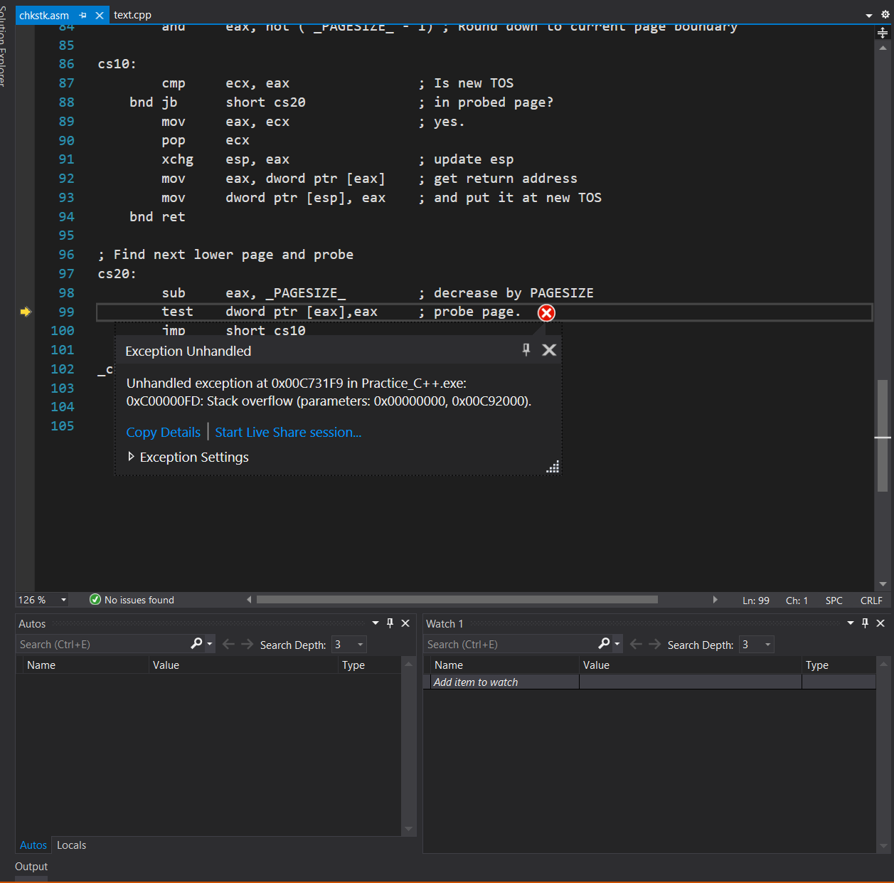

# 2021 SW개발 능력향상 프로그램

ICPC 대회 준비

---

## 1주차 - 정수론

이론 강의를 진행하기전 [Codeforces Round #713 (Div. 3)](https://codeforces.com/group/sPvRZDMiQz/contest/1512)를 1h30m 동안 풀어보는 시간을 가졌는데 7문제 중 3문제를 풀었다.

### 소인수분해, 에라토스테네스의 체

-   O(logn) 약수 찾기

> 어떤 정수 n, a, b에 대해서
> n = a\*b, a<=b이면 1<=a<=logn이 성립

> [BOJ 14563 완전수](https://www.acmicpc.net/problem/14563)

```c++
int sum=1;
for(int i=2; i*i<=x; i++) {
  if(x%i==0) {
    sum += i;
    if(i*i != x) {
      sum += x/i;
    }
  }
}
```

> 이렇게 코드를 작성하면 실패로 결과가 나온다.
> i=1부터 시작하고 마지막에 sum -= x를 해주는 대신 1은 모든 수의 약수니깐 sum에 1을 미리 넣어주고 i=2부터 시작하면 결과적으로 동일해야된다고 생각하는데 왜 실패가 나오는지 이유를 잘 모르겠다.

-   소수 판별

> [BOJ 1978 소수찾기](https://www.acmicpc.net/problem/1978)

> 약수 찾기를 응용해서 2부터 log n까지만 고려해주면 된다. (약수는 쌍을 이루는데 그 중 한 수는 log n보다 무조건 작거나 같다.)

-   소인수분해

> [BOJ 11653 소인수분해](https://www.acmicpc.net/problem/11653)

> 마지막에 남은 수를 출력하기 위해서 i<=n까지 for문을 돌렸었는데 i\*i<=n으로 하다가 맨 마지막에 남은 수가 1보다 크면 소인수로 간주하도록 코드를 짜면 실행시간을 단축시킬 수 있다.

> 소인수가 하나 나오면 N/=i를 하고 다시 int i=2부터 다시 시작할 수도 있지만 동일한 소인수가 여러개 있는 경우를 생각해서 while(N%i==0)으로 동일한 소인수인 경우를 한번에 처리하고 가는것이 실행시간을 단축시키는데 도움이 될 것 같다.

```c++
int N;
cin >> N;
for (int i = 2; i*i <= N; i++) {
  while (N % i == 0) {
    cout << i << "\n";
    N /= i;
  }
}
if(N>1) cout << N << "\n";
```

-   에라토스테네스의 체

> 2이상 n 이하인 모든 소수를 구하는 알고리즘  
> 수행 시간 O(n log log n)  
> O(n)으로 구현: https://cp-algorithms.com/algebra/prime-sieve-linear.html

> [BOJ 1929 소수 구하기](https://www.acmicpc.net/problem/1929)

> 수를 지워나갈때 배수의 제곱부터 시작하면된다.  
> 예를 들어 7의 배수를 지워나갈때 7x2가 아닌 7x7부터 시작하면 된다. 왜냐하면 7x2는 2의 배수이기 때문. 따라서 7보다 작은 수와의 곱은 이미 앞에서 지워졌다.  
> ( 32ms -> 16ms )

```c++
for (int i = 2; i * i <= n; i++)
  if (arr[i] == 1)
    for (int j = i * i; j < arr.size(); j += i)
      arr[j] = 0;
```

-   에라토스테네스의 체를 사용한 빠른 소인수 분해

> [BOJ 16563 어려운 소인수분해](https://www.acmicpc.net/problem/16563)  
> 런타임 에러 (OutOfBounds) - 문제 조건을 잘못 읽어서 자연수의 범위가 1000000까지인줄 알아서 난 오류

> 시간초과 - 기존 코드에서 입출력 최적화를 해주면 해결.

### 입출력 최적화

```c++
  ios_base::sync_with_stdio(0);
  cin.tie(0);
```

알고리즘 문제를 풀 때는 싱글 쓰레드 환경을 사용하므로 위 코드로 동기화를 끊고 최적화해서 cin, cout을 쓰는게 시간적인 측면에서는 가장 좋을 것 같다. (동기화를 끊기 때문에 scanf, printf와 혼용하면 오답이 나올 수 있다.)  
참고: https://hegosumluxmundij.tistory.com/54

> 강사님의 코드 수행시간 개선(792ms -> 616ms)  
> 소수 구하기에서 했던 것처럼 배수의 제곱부터 시작하면 중복되는 반복을 피할 수 있어서 수행시간을 단축하는데에 도움이 된다.  
> 소수에 해당하는 부분에 0이 들어가기 때문에 나중에 별개로 처리해줘야하지만 나중에 정렬을 해줄 필요가 없어서 수행시간을 단축할 수 있다.

```c++
if (k > 1) cout << k << "\n";
```

-   연습문제

[BOJ 2312 수 복원하기](https://www.acmicpc.net/problem/2312) - 성공

> 에라토스테네스의 체를 활용하면 수행시간을 개선할 수 있을지도? 지금은 16ms

[BOJ 1929 소수 구하기](https://www.acmicpc.net/problem/1929)

> 이미 한번 풀어봤던 문제, [성공](https://www.acmicpc.net/submit/1929/32072578)  
> 저번에 제출했을때 16ms였는데 이번에는 20ms여서 확인해보니깐 이번에 풀때 처음에 1000000짜리 벡터를 초기화해놓고 사용해서 그랬다.

[BOJ 11689 GCD(n, k) = 1](https://www.acmicpc.net/problem/11689)

> **런타임 에러(bad_alloc)** - new 연산으로 메모리 할당이 실패하면 std::bad_alloc이라는 예외가 발생한다. 찾아보니 벡터를 너무 크게 선언해서 메모리 제한에 걸리면서 이러한 에러가 발생한 것 같다. (전역변수로 선언하면 할당되는 공간이 달라서 될때도 있다.)

> 시간초과 - 벡터를 사용해서 하나하나 돌리지말고 전체 개수에서 n과 서로수가 아닌수의 개수를 빼야할것같다. 입력의 크기가 10^12이므로 O(n) 알고리즘은 시간초과가 나올 것이다.

> [시간초과](https://www.acmicpc.net/submit/11689/32080194) - n의 약수로 서로수가 아닌수의 개수를 계산해봤지만 겹치는 경우를 고려하다보니 계산량이 많아진 것 같다.

### 수행 시간 어림짐작하기

입력의 크기를 시간 복잡도에 대입했을때 그 값이 1억(10^8)을 넘어가면 시간 초과 가능성이 있다.

[BOJ 2960 RESETO](https://www.acmicpc.net/problem/2960)

> [성공](https://www.acmicpc.net/submit/2960/32082239)

[BOJ 1816 암호 키](https://www.acmicpc.net/problem/1816)

> [성공](https://www.acmicpc.net/status?user_id=dkscltks&problem_id=1816&from_mine=1)  
> 10^6까지 에라토스테네스의 체를 사용해서 소수를 구하고 그 소수들로 해당 수들을 나눠서 모든 소인수가 10^6보다 큰지 확인

[BOJ 9020 Goldbach's Conjecture](https://www.acmicpc.net/problem/9020)

> [성공](https://www.acmicpc.net/submit/9020/32084910)  
> 오.. 생각보다 cin, cout 최적화 여부가 수행시간에 영향을 많이 준다. 252ms -> 0ms

[BOJ 4948 Chebyshev's Theorem](https://www.acmicpc.net/problem/4948)

> 이미 한번 풀어본 문제, [성공](https://www.acmicpc.net/submit/4948/32095596)

[BOJ 1747 소수&팰린드롬](https://www.acmicpc.net/problem/1747)

> [실패](https://www.acmicpc.net/submit/1747/32097156) - 소수인지 체크하는 함수, 팰린드롬인지 체크하는 함수를 만들어서 N부터 1씩 증가시키면서 찾는 방식으로 구현했다. 시간초과는 나올 수도 있을거라고 생각했는데 그냥 틀렸다고 나와버려서 좀 막막하다.
> [해결!](https://www.acmicpc.net/submit/1747/32136437) - 소수를 체크하는 함수에서 2보다 작은 수에 대한 예외처리를 하지않아서 오답이 나왔었다.

[BOJ 어려운 소인수분해](https://www.acmicpc.net/problem/16563)

> 풀어본 적 있는 문제, [성공](https://www.acmicpc.net/submit/16563/32097917)  
> 예전에 풀었을때보다 수행시간이 더 오래 걸려서 확인해보니 벡터보다는 배열을 쓰는것이 더 빠르다.  
> 그리고 함수로 나눠서 구현하는 것보다 main 함수 안에서 구현하는것이 수행시간은 더 적게 나온다.

### 모둘러 연산

> 아주 큰 정수가 계산 과정에 나오는 경우  
> 아주 작은 유리수를 다루는 경우

-   연산들의 구현(modular int)
    -   연산할때마다 결과에 모듈러 연산을 적용
    -   기초 연산들을 함수로 구현
    -   Modular int 구조체를 만들어 사용  
        (보통 레퍼런스 노트를 가지고 문제를 풀 때 사용)

```c++
const long long MOD = 998244353;
//상수로 만들면 소수를 직접 입력하는 것보다 실수를 줄일 수 있다.
//C++에서는 const를 쓰는 것이 #define을 쓰는 것보다 수행시간이 빠르다.
long long madd(long long a, long long b) {
  return (a + b) % MOD;
}
long long msub(long long a, long long b) {
  return (a - b + MOD) % MOD;
}
long long mmul(long long a, long long b) {
  return (a * b) % MOD;
}
```

> 뺄셈의 경우 결과값이 음수가 될 수 있으므로 (a-b)%p의 경우 (a-b+p)%p로 게산하는것이 편리하다.

> 곱셈의 경우 오버플로우가 발생할 수 있어서 64-bit 정수 자료형(long long)을 사용하는 것이 안전하다.

> 나눗셈. 곡셈의 역원.  
> 조합론에서 큰 수로 이루어진 분수를 약분해야 할 때 유용하게 사용할 수 있다.  
> 페르마의 소정리 사용.

-   페르마의 소정리

> a^p = a mod p  
> a \* a^(p-2) = 1 mod p  
> 여기서 a^(p-2)를 a에 대한 곰셈의 역원이라고 한다.

> 미트마스크를 이용한 방식은 이해하지 못함.

[BOJ 13977 이항 계수와 쿼리](https://www.acmicpc.net/problem/13977)

> 예제를 출력할때 터무니 없이 큰 값이 나온다. <del>아직 모듈러 연산에서 곱셈 역원을 잘 이해하지 못해서 구현에 실패한 것 같다.</del> modpow 연산을 잘못 구현했었다.

> 

> 시간초과 - 큰 수의 팩토리얼을 구하는 만큼 미리 팩토리얼을 구해서 배열로 저장해 놓아야 한다.
> (그런데 팩토리얼을 벡터로 저장하면 오류가 나지 않는데 배열로 저장하면 stack overflow 오류가 나는데 이유를 잘 모르겠다.)
> **vector는 범위를 벗어나면 자동으로 종료하는 기능이 있다고 하니 배열로 구현할때 범위를 벗어나게 코드를 짰는지 다시 한번 살펴볼것.**

```c++
ll fact[4000001];
fact[0] = 1;
for (int i = 1; i < 4000001; i++) {
  fact[i] = mmul(fact[i - 1], i, MOD);
}
```

> 

> 그리고 앞에서 쓴적이 있는 cin, cout 실행 시간 개선 코드를 추가해줘야한다.

```c++
  ios_base::sync_with_stdio(0);
  cin.tie(0);
```

### 1주차 과제

[2020-2021 ICPC, NERC, Southern and Volga Russian Regional Contest (Online Mirror, ICPC Rules)](https://codeforces.com/group/sPvRZDMiQz/contest/1468)

> 14문제 중 3문제 해결. 3문제는 시도했지만 실패.

> F문제에서 시간 초과 오류가 났는데 알고리즘을 어떻게 개선해야 할지 감이 잡히지 않는다. 종만북 등의 방법을 통해 필수 알고리즘을 빨리 숙지해야 할 것 같다.

> C문제 풀어보기.  
> [우선순위 큐 사용해보기](https://codingdog.tistory.com/entry/c-priority-queue-%EC%98%88%EC%A0%9C-compare-%EA%B5%AC%EC%A1%B0%EC%B2%B4%EB%A7%8C-%EC%9E%98-%EC%A0%95%EC%9D%98%ED%95%A9%EC%8B%9C%EB%8B%A4)  
> 시간순, 금액순 우선순위큐 2개랑 주문을 받았는지 체크하는 벡터1개를 사용해서 구현.  
> test 6에서 실패  
> 3번웨이터가 손님의 돈이 같으면 더 빨리 온 손님을 받는다는 조건을 빼먹었다. **문제를 꼼꼼히 읽자...**

## 2주차 - 분할정복

### 매개변수 탐색

[BOJ 1654 랜선자르기](https://www.acmicpc.net/problem/1654)

> 실패
>
> 1.  젤 긴 로프의 길이를 right의 초기값으로 사용해야 한다.
> 2.  로프의 개수가 N보다 클 경우에 left = half + 1로 설정하면 안된다. left = half.

[BOJ 2110 공유기 설치](https://www.acmicpc.net/problem/2110)

> 와 풀었다. 처음 풀어보는 유형이라 그런지 처음에는 어떻게 분할 정복으로 풀어야할지 감이 안 잡혔는데 그림 그려가면서 고민해보다가 결국 풀었다!  
> 가장 인접한 두 공유기 사이의 거리를 분할 정복을 통해 구하면 된다. 거리를 미리 정해두고 검증하는 방법.

### 삼분 탐색

[BOJ 8986 전봇대](https://www.acmicpc.net/problem/8986)

### 인터랙티브

[BOJ 19554 Guess the number](https://www.acmicpc.net/problem/19554)

> 실패 - 문제를 잘못 이해했었다...

[1주차 과제 - F. Full Turn](https://codeforces.com/group/sPvRZDMiQz/contest/1468/problem/F)

> 강사님의 설명을 들으니깐 풀이 자체는 동일한것같은데 구현을 잘못해서 틀린거같다.

-   **실패** - int형을 쓰면 뒤쪽 test case에서 실패. override 때문이려나.
-   **실패** - 벡터 크기를 통일하는 과정에서 예를 들어서 6, 14처럼 14가 6으로 나누어떨어지진 않지만 3, 7로 약분할 수 있는 경우를 고려하지 않았다.

**최대공약수(gcd) - 유클리드 알고리즘**

```c++
ll gcd(ll a, ll b) {
	if (b == 0) return a;
	return gcd(b, a % b); // 만약 b가 a보다 크다면 이 과정에서 swap이 되므로 따로 예외처리를 해줄 필요가 없다.
}
```

그리고 절댓값을 구할때 abs를 사용하는 것보다는 따로 if문으로 처리하는 것이 수행시간이 더 빠르다.

-   **시간초과** - vector를 이용해서 구현하면 시간초과. map을 이용해서 구현해야하는 것 같다.  
    같은 시야를 가진 사람들 묶어서 처리  
    map.find()활용.

**참고**: map에서 key값으로 구조체를 사용할떄 값이 2개이면 구조체대신 pair 클래스를 사용하자.

    map에서 key값으로 구조체를 활용하려면 < 연산자를 override 해주어야한다.
    왜냐하면 map에서 key 값은 이진트리에서 탐색을 할 수 있는 조건이 되어야 하기 때문에 대소 비교가 가능해야 한다.

```c++
bool operator<(const 클래스명& 변수명) const
{
  //비교구문을 통해 true, false를 반환
}
```

    pair 클래스의 경우 sort 알고리즘에 의해 정렬이 가능하기 때문에 2가지 값을 묶어서 사용할떄는 구조체보다 편리하게 사용할 수 있다.
    (첫번째 인자 기준, 첫번쨰가 같으면 두번째 인자로 판단)

### 2주차 과제

[2018-2019 ICPC, NEERC, Southern Subregional Contest (Online Mirror, ACM-ICPC Rules, Teams Preferred)](https://codeforces.com/group/sPvRZDMiQz/contest/1070)

D - 해결. H - 시간초과, K - 오답(문제에서 출력을 Yes랑 No로 하라고 했는데 YES랑 NO를 출력해서 틀렸었다 ㅋㅋㅋㅋ. **문제를 잘 읽자**)

[H. BerOS File Suggestion](https://codeforces.com/group/sPvRZDMiQz/contest/1070/problem/H)

> 강사님의 설명(문자열마다 해당 문자열의 substring을 다 만들어두고 체크.)을 듣고 다시 한번 풀어봤다.  
> 메모리초과 - 이것저것 다 저장하느라 `vector<pair<string, map<string, int>>> files;` 이런 자료형을 사용해서 그런 것 같다.

> 강사님 코드에서 어떤 자료형을 사용했는지 참고해서 다시 시도.  
> 실패 - 같은 문자열에서 substr이 중복되는 경우를 생각하지 못했다.  
> 성공. 327ms

### 1주차 연습문제

[BOJ 11689 GCD(n, k) = 1](https://www.acmicpc.net/problem/11689) - 성공(수많은 실패 후..)

> 그냥 풀려고 여러 차례 시도해봤는데 시간초과가 나거나 벡터를 이용해서 풀면 bad_alloc 에러가 나왔다. 알고보니 오일러 파이 함수를 알아야 풀 수 있는 문제였고 이런 유형의 문제가 꽤 있는 것 같다. [오일러 파이 함수](https://dimenchoi.tistory.com/52)

> 오버플로우 나지않게 주의하기. 큰수끼리 나눗셈과 곱셈을 해야할때 곱셈을 먼저한다면 오버플로우가 날 수 있다.

> 소인수분해 할때 시간초과 나지 않게 주의. O(logn) 약수 찾기에서 나왔던 내용을 잊고 있었다. 정말 큰 소수를 소인수분해할때 O(logn)으로 구하지 않는다면 시간초과가 날 수 있다.

[BOJ 13977 이항 계수와 쿼리](https://www.acmicpc.net/problem/13977)

> 이미 한번 풀어봤던 문제. 모듈러 연산 복습.

> 시간초과 - 거듭제곱의 분할정복으로 구현해야되는걸 까먹었다. 이번엔 재귀함수로 구현해봤다.

> 문제에서 수의 범위를 잘못봐서 처음에 factorial을 배열로 저장했을때 메모리 오류가 났었다.

> 성공 - 한번 풀어봤는데도 불구하고 시간이 좀 지나고 다시 풀어보려니깐 상당히 어려웠다...

[BOJ 4233 Pseudoprime numbers](https://www.acmicpc.net/problem/4233)

> 성공 - BOJ 13977 하위 호환 같은 느낌.

[BOJ 10422 괄호](https://www.acmicpc.net/problem/10422)

> 괄호 문자열의 개수를 구하는 방법을 생각해내기가 좀 까다로웠다.
>
> 1. 홀수의 경우 성립 x
> 2. (S) / ST 이렇게 2가지 경우 생각.

> 약간 피보나치 수열이랑 비슷한 느낌. 배열로 저장해서 사용하면 될것같다.

> 처음에 (1,1,8) 처럼 너무 세부적으로 나눠서 생각해서 시간초과가 나올 것 같다고 생각했는데 잘 생각해보니 (1,1,8)은 (2,8), (1,9)에도 포함된다.
>
> _실패_  
> 따라서 예를 들어 L=8이라면(L/2 = 4)  
> 3 + (1, 3) + (2, 2) + (3, 1) 이렇게 계산하면 된다.  
> 근데 중복되는 경우를 어떻게 제외해야 할까...

> _실패2_  
> 길이가 10인 문자열 = (4) + (3)1 + (2)2 + (1)3 + ()4  
> **해결!** ㅋㅋㅋㅋㅋ 피곤해서 그런가 mod 연산을 포함시키지 않고 계속 헤매고 있었다.

드디어 1주차 문제 한번씩 다 풀어봤다.

### 2주차 문제

1. 매개 변수 탐색

[BOJ 1654 랜선 자르기](https://www.acmicpc.net/problem/1654)

> 한번 풀어봤던 문제. 성공. 구간을 어느정도 남겨두고 마지막에 그 구간만 체크하는게 확실히 구현할떄 훨 편하긴 한거같다. 실패할 확률도 적고.

[BOJ 2110 공유기 설치](https://www.acmicpc.net/problem/2110)

> 한번 풀어봤던 문제. 성공

[BOJ 22254 공정 컨설턴트 호석](https://www.acmicpc.net/problem/22254)

> **시간 초과** - 주어진 공장 라인 개수로 정해진 시간 안에 완료할 수 있는지 확인하는 과정에서 sort를 n-라인개수만큼 수행하다보니 시간초과가 나는것같다.  
> 11%에서 시간초과 - 공장 라인을 일단 다 채우고 시작해서 확인과정의 시간복잡도를 조금 개선했다.

> 감이 영 안잡혀서 구글링 해보니깐 **우선순위큐**라는 키워드가 눈에 들어왔다.  
> 우선순위큐를 이용해서 구현해봤는데 틀렸다고 나온다. -> 중간에 자료형을 int로 잘못썼는데 그래서 오버플로우가 나온 것 같다.

> 성공.

[BOJ 1477 휴게소 세우기](https://www.acmicpc.net/problem/1477)

> 보류. 어떻게 풀어야할지 감이 잘 오지 않는다..

2. 삼분 탐색

[BOJ 11664 선분과 점](https://www.acmicpc.net/problem/11664)

> 성공. 3차원 자표라 x, y, z를 다루는게 조금 귀찮긴 했지만 그래도 꽤 수월하게 풀었다. 삼분탐색을 알고 있고 구현에만 조금 신경쓴다면 쉽게 풀 수 있다.

3. 인터랙터

[BOJ 19554 Guess the number](https://www.acmicpc.net/problem/19554)

> 이미 한 번 풀어봤던 문제. 성공

[BOJ 20216 Ducky Debugging](https://www.acmicpc.net/problem/20216)

> 성공. `cin`으로 입력받으면 스페이스바를 입력받지 못해서 `std::getline`을 활용했다.

[BOJ 21336 Cheating](https://www.acmicpc.net/problem/21336)

> 보류. 비밀번호를 어떻게 구해야할지 생각을 좀 해봐야곘다.

## 3주차 - DP

### DP

-   DP문제는 크게 반복문과 재귀함수를 이용해서 구할 수 있다. 가능하면 두 방법으로 한번씩 풀어보는 것이 좋다.

[BOJ 10870 피보나치 수 5](https://www.acmicpc.net/problem/10870)

> 성공. 재귀함수로 간단하게 구현할 수 있다.

[BOJ 2747 피보나치 수](https://www.acmicpc.net/problem/2747)

> 반복문으로 성공. 재귀함수로 한번 풀어봤는데 시간초과가 나온다.  
> -> 재귀함수로 구현할때 배열에 존재하는 값이 아니면 배열에 값을 저장한뒤 그 값을 반환해야하는데 저장하는 과정없이 반환만 해서 시간초과가 나왔었다.

```c++
else {
        return fibo_cal(fibo, n - 1) + fibo_cal(fibo, n - 2);
        // fibo[n] = fibo_cal(fibo, n - 1) + fibo_cal(fibo, n - 2);
        // return fibo[n];
    }
```

[BOJ 1932 The Triangle](https://www.acmicpc.net/problem/1932)

> 반복문으로 성공.  
> 재귀함수로 한번 풀어보기.

[BOJ 11659 구간 합 구하기 4](https://www.acmicpc.net/problem/11659)

> 반복문으로 성공.
> 재귀함수로 한번 풀어보기.

[BOJ 11660 구간 합 구하기 5](https://www.acmicpc.net/problem/11660)

>

[BOJ 9184 Function Run Fun](https://www.acmicpc.net/problem/9184)

> 재귀 함수로 성공. 처음에 범위를 잘못 설정해서 OutOfBounds 오류가 나왔었다.  
> -50 부터 50까지가 범위인데 사이즈가 100짜리인 array를 썼었다.

[BOJ 1912 연속합](https://www.acmicpc.net/problem/1912)

> LIS인 것 같지만 그냥 한번 풀어봤다. 아까 풀었던 구간 합 구하기를 응용해서 풀어봤는데 시간복잡도를 어림짐작해보니 O(n^2)에 입력사이즈가 10^5라서 대입해보니 100억이라 시간초과가 나올거라고 예상했는데 실제로 시간초과가 나와서 틀렸지만 조금 뿌듯했다.

> 좀 고민해봤는데 어려워서 LIS를 공부하고 다시 풀어보기로 했다.

### LIS

Longest Increasing Subsequence

강의 영상 시점: 2:00~2:37PM쯤

부분수열을 처음에 숫자들이 무조건 연속해서 있어야 한다고 잘못 이해했었다.

-   O(n^2) DP

> **각 원소를 마지막으로 하는 최장 증가 수열 길이 배열 B**  
> 원소를 삽입할 때마다 앞의 원소들을 다 확인해야 하기 때문에 시간복잡도가 O(n^2)이다.

[BOJ 11053 가장 긴 증가하는 부분 수열](https://www.acmicpc.net/problem/11053)

실패 - 처음에 부분 수열을 잘못 이해하고 있어서 map에 다 집어넣고 map의 size를 출력해서 틀렸다.

성공. 강의 자료에서 A[i]를 마지막 원소로 가지는 가장 긴 부분수열의 길이를 저장하는 배열 B를 만들라는 부분에서 힌트를 얻고 풀었다.

-   경로 역추적

[BOJ 14002 가장 긴 증가하는 부분 수열 4](https://www.acmicpc.net/problem/14002)

자료구조 수업 시간에 비슷한 문제를 풀어봐서 구현은 나름 수월하게 했는데 틀렸다고 나온다.

1. 최대 부분 수열의 길이를 구하는 부분을 잘못 짰다. prev와 B 배열이 매칭되지 않을 수 있다.
2. 최대 부분 수열의 길이의 최솟값은 1인데 `max_len`의 초기값을 0으로 잡으면서 오답이 나왔다.

BOJ 11053부터 다시 풀어보고 있는데 분명 맞게 푼거같은데 틀리다고 나온다.  
-> 길이가 가장 큰 값의 인덱스를 max_index로 저장했는데 여기에 인덱스가 아닌 길이를 저장했다. max 연산자를 사용할때 주의하자.

```c++
max_index = max(len[max_index], len[i]);
```

성공. 차근차근 풀어보니 수월하게 풀 수 있었다.

-   길이별 배열로 변환

> **각 증가 수열의 길이별 가장 작은 마지막 원소 배열 C**

    A: 1 5 3 4 2 6
    B: 1 2 2 3 2 4
    C: 1 2 4 6

> 배열 C는 단조증가하기 때문에 이분 탐색을 통해 O(log n)에 배열에 배치할 위치를 결정할 수 있기 때문에 시간복잡도가 O(nlongn)이다.  
> 하지만 각 증가 수열의 길이별 가장 작은 마지막 원소만을 저장하기 때문에 경로 역추적은 할 수 없을 것 같다.

[BOJ 12015 가장 긴 증가하는 부분 수열 2](https://www.acmicpc.net/problem/12015)

실패. 이분탐색을 할때 조건을 잘못 설정했었다.

성공.

### 연습문제

[BOJ 1912 연속합](https://www.acmicpc.net/problem/1912)

**실패**. 음수 다음에 양수를 더해서 0보다 커지는 경우를 고려하지 않았다.

**성공**. dp에 좀 익숙해져서 그런가 두번째 시도에서는 꽤 수월하게 풀었다.

[BOJ 11051 이항 계수 2](https://www.acmicpc.net/problem/11051)

**성공**. dp를 이용해서 풀어봤다. (이항 계수 피라미드) 4ms

**성공**. 모듈러 연산으로도 풀어봤다. 0ms

[BOJ 11660 구간 합 구하기 5](https://www.acmicpc.net/problem/11660)

**성공**. 행마다 열의 누적합을 배열로 저장해서 풀었다. 392ms.

[BOJ 12852 1로 만들기 2](https://www.acmicpc.net/problem/12852)

**성공**. 60ms. 최소값이랑 다음 숫자를 각각 다른 배열에 저장해서 풀었다.

[BOJ 9251 LCS](https://www.acmicpc.net/problem/9251)

**실패**. 한 문자열에서 부분 수열을 하나씩 추출해서 다른 문자열에 해당 부분 수열이 있는지 검사해서 가장 긴 문자열을 찾는 방법으로 구현하려고 했는데 부분 수열을 구하는 과정에서 무조건 시간초과가 날 것 같다. 어떻게 dp로 풀어야할지도 감이 잘 안 온다.

참고해서 푼 블로그: https://hini7.tistory.com/68

**부분문제**로 나눠서 생각하면 a_i=0, b_i=0부터 시작해서 3가지 경우중 최대값을 출력하면 된다.

**부분 문제로 나눠서 생각해보는 연습을 해야겠다. 특히 dp 문제에서**

```c++
int lcs(string& a, string& b, int a_i, int b_i) {
    // base case
    if (a_i == a.size() - 1 || b_i == b.size() - 1) return 1;
    int ret = 0;
    if (a[a_i] == b[b_i]) ret = lcs(a, b, a_i + 1, b_i + 1) + 1;
    ret = max(ret, lcs(a, b, a_i + 1, b_i));
    ret = max(ret, lcs(a, b, a_i, b_i + 1));
    return ret;
}
```

하지만 이렇게 하면 시간초과가 나오는데 이를 해결하기 위해 dp를 사용하면 된다.
결과값을 map에 저장해서 구현했다.

**오답**. 문자열의 마지막 글자가 다른 문자열에 무조건 포함된다고 가정하고 basecase를 잘못 정했었다.

**시간초과**. 98%에서 시간초과가 났다.
-> map.find 함수 때문인거같다.

**오답**. map대신 이차원배열에 값을 저장했는데 98%에서 오답이 나온다.  
-> 1000글자짜리 문자열을 사용할때 범위를 벗어나면서 오류가 나서 그렇다.  
`int arr[1001][1001]`를 사용하거나 함수 맨 처음부분에서 범위를 벗어나면 0을 반환하도록 작성하면 된다.

```c++
if (a_i >= a.size() || b_i >= b.size()) {
        return 0;
    }
```

**성공**. 참고로 a[a_i] == b[b_i]이면 다른 경우는 고려하지 않고 바로 a_i+1, b_i+1로 넘어가면 된다.(12ms->8ms)

```c++
    if (a[a_i] == b[b_i]) ret = lcs(a, b, a_i + 1, b_i + 1) + 1;
    else ret = max(lcs(a, b, a_i, b_i + 1), lcs(a, b, a_i + 1, b_i));
```

### 3주차 과제

[2019-2020 ICPC, Asia Jakarta Regional Contest (Online Mirror, ICPC Rules, Teams Preferred)](https://codeforces.com/group/sPvRZDMiQz/contest/1252)

A문제 해결.  
C(어떻게 풀어야할지 잘 모르겠다), H(오답), K(시간초과) 시도.

문제 C - [BOJ 19157 Even Path](https://www.acmicpc.net/problem/19157)

강사님의 해설을 들으면서 열이나 행이 홀수->짝수나 짝수->홀수로 바뀌면 경로가 있을 수 없다는 점을 놓쳤다는 것을 알았다. 그리고 누적합으로 풀면 수월하게 풀 수 있다는 점도 알았다.


성공.

## 4주차 - 그래프

### 3주차 과제 문제풀이

ICPC의 경우 해당 contest의 해설이 첨부되어있는 경우도 있으니 공부할때 참고하자.  
contest meterials -> tutorial(en)

[이번 과제 해설](https://github.com/jonathanirvings/icpc-jakarta-2019/blob/master/problem_analysis.pdf)

[BOJ](https://www.acmicpc.net/category/detail/2235)에도 해당 문제셋이 올라와있다.

[C - Even Path](https://codeforces.com/group/sPvRZDMiQz/contest/1252/problem/C)  
다시 한번 풀어보기. 행과 열의 구간을 나눠서 생각하면 된다.  
그리고 뭔가 DSU로도 풀 수 있을것같다.

[H - Twin Buildings](https://codeforces.com/group/sPvRZDMiQz/contest/1252/problem/H)

[K - Addition Robot](https://codeforces.com/group/sPvRZDMiQz/contest/1252/problem/K)

### DSU

DSU란 해당 원소가 같은 집합 내에 포함되어 있는지 빠르게 확인하기 위해서 사용되는 자료구조

-   find 연산: 해당 element가 속해있는 집합의 대표원소를 반환
-   merge 연산: 2개의 집합을 1개의 집합으로 합침

https://kangminjun.tistory.com/74 참고

[BOJ 1717 집합의 표현](https://www.acmicpc.net/problem/1717)

성공. 개념만 안다면 구현 자체는 그렇게 어렵진 않은 것 같다.

### C++에서의 struct

C++에서 struct는 class와 동작방식이 일치한다. 단, struct의 접근 지시자는 항상 public로 통일되어 있다는 차이점이 있다.

```c++
class DSU {
    vector<int> parent;
    vector<int> count;

   public:
    DSU(int n) : parent(n), count(n, 0) {
        for (int i = 0; i <= n; i++) {
            parent[i] = i;
        }
    }
    ...
}
```
이런 식으로 구조체와 클래스에서 생성자를 이용해 벡터의 값도 초기화 할 수도 있다.

    offline query
    : query를 입력받아서 나중에 처리하는 방식

### SCC

SCC 하나하나를 한 개의 노드로 압축시켜서 포현할 수 있다.

이때 압축된 그래프는 항상 DAG(싸이클 없는 방향 그래프)이다.  
왜냐하면 싸이클은 이미 SCC에 포함되어 있기 때문이다.

타잔알고리즘. DFS 응용분야이므로 DFS 복습하고 한번 구현해보자.

강의자료만으로는 이해가 잘 안되서 [블로그](https://jason9319.tistory.com/98)를 참고했다.

[BOJ 2150 Strongly Connected Component](https://www.acmicpc.net/problem/2150)

타잔알고리즘이 아직 잘 이해가 안되서 우선 구현이 더 간편한 코사라주 알고리즘으로 풀어봤다. 코드 보지않고 직접 구현 성공. 32ms.

타잔알고리즘으로 구현. 실패. https://www.acmicpc.net/board/view/33601 마지막 테스트 케이스에서 실패. 부모정점의 값이 나중에 변경되는 경우 자식정점과 부모정점의 값이 다르게 업데이트되는 경우를 어떻게 처리해야할지 감이 잘 오지 않는다. -> 2번 과정을 재귀적으로 구현해서 부모정점의 값을 먼저 업데이트하자. 성공. 28ms.

dfs를 재귀함수로 구현할 수 있다는 것도 알게되어서 [BOJ 2606 바이러스](https://www.acmicpc.net/problem/2606)문제를 dfs(재귀함수)로 다시 풀어봤다.

#### 코사라주 알고리즘

정방향으로 한번, 역방향으로 한번 DFS를 수행하는 방식.

1. 정방향 그래프에서 모든 정점에 대해 DFS를 수행하면서 끝나는 순서대로 스택에 삽입.
2. 스택에서 하나씩 꺼내서 역방향 그래프에서 DFS를 수행.
3. 스택이 빌때까지 2번 과정을 반복. 한번 DFS를 수행할때 검색된 정점들은 같은 SCC에 속한다.

#### 타잔알고리즘

DFS를 수행하면서 부모 정점을 업데이트해나가는 방식.

1. DFS를 수행하면서 해당 정점에 몇번째로 도착했는지 저장한다.

   그리고 연결된 정점 중 순서가 가장 빠른 정점을 부모로 삼는다.

   연결된 정점은 크게 3가지 경우가 있다.

   - `아직 방문하지 않은 정점`: 해당 정점에 대하여 1번 과정을 수행한 후 값을 비교

     이 부분을 위해 재귀적으로 구현한다.

   - `방문했지만 SCC에는 아직 포함되지 않은 정점`: 저장되어 있는 값을 비교

   - `SCC에 포함되어 있는 정점`: 고려 X

2. 부모 정점이 자기 자신인 경우 해당 정점이 나올때까지 stack에 pop을 해서 하나의 scc로 취급한다.

#### 2-SAT

### MST

최소 스패닝 트리. 개념 자체는 그렇게 어렵진 않은 것 같다. 한번 구현해보자.

[BOJ 1197 최소 스패닝 트리](https://www.acmicpc.net/problem/1197)

성공. 392ms. 크루스칼 알고리즘 사용. DSU가 살짝 가물가물해서 시간이 조금 걸렸다.

성공. 52ms. 프림의 알고리즘(heap) 사용.

성공. 300ms. 프림의 알고리즘(array) 사용.

#### 크루스칼(Kruskal)의 알고리즘

edge의 가중치가 작은 순서대로 DSU를 사용해서 그래프의 정점들을 하나씩 merge해나가는 방식.

간선을 정렬할때 O(ElogE), 병합할때  매우 작은 시간이 걸려 시간복잡도는 총 O(ElogE)

#### 프림(Prim)의 알고리즘

다익스트라 알고리즘과 비슷하다.

heap 이용

1. 정점(A)을 하나 정한 뒤 해당 정점과 인접하고 아직 방문하지 않은 정점(B) heap에 {A-B 가중치, 정점} 형식으로 push
2. heap에서 꺼낸 정점이 아직 방문하지 않았다면 해당 정점에 대해 1과정 수행.
3. heap이 빌때까지 반복

배열을 이용해서는 어떻게 구현해야할지 잘 모르겠다. 다익스트라 알고리즘에서는 출발점에서부터의 거리를 기준으로 거리가 가장 짧은 정점을 다음 정점을 정하고 정점을 방문할때마다 거리를 업데이트하는 방식으로 구현하는데

프림의 알고리즘에서는 시작점부터 해당 정점까지의 거리보다 어느 간선을 사용하는지가 더 중요하기 때문에 좀 머리가 복잡해진다.

-> 시작점부터 해당 정점까지의 거리 대신 간선의 가중치를 저장해서 구현하면 될거같다. 성공.

array 이용

1. 가중치를 저장할 배열을 하나 사용한다.

2. 정점을 하나 정해서 방문한다.

3. 해당 정점과 인접한 아직 방문하지 않은 정점에 대해서 가중치를 더 작은 값으로 변경한다.

   다익스트라 알고리즘에서는 시작점부터 해당 정점까지의 거리를 저장하지만 프림의 알고리즘에서는 해당 정점과 바로 연결되어 있는 간선의 가중치를 저장한다.

4. 가중치가 가장 작은 정점을 방문한다. 

5. 모든 정점을 방문할때까지 3-4과정 반복

[BOJ 1922 네트워크 연결](https://www.acmicpc.net/problem/1922)

성공. 문제 설명만 좀 다르고 [BOJ 1197 최소 스패닝 트리](https://www.acmicpc.net/problem/1197)랑 완전히 동일한 문제. 프림 알고리즘(heap)으로 풀었다.

### 추가정보

Atcoder - 개인대회 연습하기 좋다. ABC 대회 추천.
레퍼런스가 허용되는 대회의 경우 atcoder 라이브러리를 연습하면 좋다.  
atcoder에 라이브러리 연습하라고 만들어놓은 대회도 있음.

백준에 라이브러리 별로 잘 정리되어 있기 때문에 라이브러리 연습하기에 상당히 유용하다.

### 그래프(이전 강의자료)

#### DFS, BFS 복습

[BOJ 2606 바이러스](https://www.acmicpc.net/problem/2606)

DFS, BFS로 풀 수 있는 문제

DFS 시도. 오답. 더 이상 방문할 노드가 없는지 체크하는 부분에서 노드를 찾은 경우 index의 값이 바뀐다는걸 미처 생각하지 못했다.  
성공.

BFS 시도. 성공.

[BOJ 1260 DFS와 BFS](https://www.acmicpc.net/problem/1260)

성공. DFS와 BFS 구현하는 문제.

[BOJ 1697 Catch That Cow](https://www.acmicpc.net/problem/1697)

뭔가 DP로 풀 수 있을 것 같아서 시도 -> 시작값과 끝값에 따라서 그때그때 값이 달라져서 dp로 풀기에 적합하지 않은 것 같다.  
(찾아보니 cycle이 생겨서 무한루프에 빠지기 때문에 dp로는 풀 수 없다고 한다. https://blog.encrypted.gg/33)

BFS로 시도. 오답.

성공. n==k인 경우를 고려하지 못했었다.

[BOJ 2178 미로 탐색](https://www.acmicpc.net/problem/2178)

성공. 2차원이라 구현하면서 조금 복잡해서 헤매긴했지만 그래도 수월하게 풀었다.

[BOJ 13914 숨바꼭질 4](https://www.acmicpc.net/problem/13913)

성공. 1697번 문제에서 경로 출력만 추가된 문제라 쉽게 풀 수 있었다.

#### 최단경로

##### 플로이드-워셜 알고리즘

모든 중간점 k에 대해서 k를 지나치는 모든 경로를 검사 후 업데이트한다.

모든 시작점, 음수 가중치 가능, 시간복잡도 O(v^3)

```c++
for (int k=0; k<n; k++) {
	for (int i=0; i<n; i++) {
		for (int j=0; j<n; j++) {
			path[i][j] = min(path[i][j], path[i][k]+path[k][j]);
        }
    }
}
```

[BOJ 11404 플로이드](https://www.acmicpc.net/problem/11404)

시작 도시와 도착도 시가 같다는 조건과 시작도시와 도착도시를 연결하는 노선이 하나가 아닐 수 있다는 조건을 놓쳐서 좀 헤맸다.

실패. 한번에 가는 버스가 없는 경우 최소 비용이 최대 100,000*100까지 증가한다는걸 고려하지 못했다.    

성공.

##### 다익스트라 알고리즘

시작점에서 출발해서 시작점부터의 거리가 가장 가까운 점을 하나씩 방문하면서 그 점과 인접한 점에 대해 시작점까지의 경로를 업데이트한다.

단일 시작점에서 다른 모든 정점. 음수 가중치 불가능.

배열을 사용하면 O(v^2), 힙을 사용하면 O(E+VlogE)로 구현가능.

가장 빠르고, 가장 자주 사용한다.

[BOJ 1916 최소비용 구하기](https://www.acmicpc.net/problem/1916)

성공. 배열 이용. 36ms.

11404 문제랑 거의 같고 다익스트라 알고리즘은 이미 자료구조 수업때 잘 공부해둬서 그런지 수월하게 풀었다.

힙으로 풀어보기. 메모리 초과. 아무래도 배열 + 우선순위큐를 사용하다보니 메모리 초과가 나오는것같다. 구글링을 해보니깐 힙으로 푼 사람이 있는데 은근 풀이가 많이 달라서 이해하려면 시간이 좀 필요할 것 같다. https://ongveloper.tistory.com/69

성공. 그전에 메모리 초과가 났던 이유는 priority_queue에서 pop을 할때 이미 방문한 노드에 대해서도 경로를 업데이트하면서 queue에 너무 많은 데이터가 들어가서 그런거같다.

[BOJ 11779 최소비용 구하기 2](https://www.acmicpc.net/problem/11779)

성공. 1916번 문제에서 경로만 추가하면 되는 문제라 수월하게 풀었다. 32ms.

#### 트리

길이가 3 이상인 사이클이 없는 연결 그래프

* ##### 지름: 트리 위에서 가장 먼 두 점의 거리

  ```
  임의의 정점 a에 대해 가장 먼 정점 x
  정점 x에 대해 가장 먼 정점 y
  x, y 사이의 거리가 트리의 지름이다.
  ```

  귀류법으로 증명할 수 있다.

[BOJ 9372 Flying Safely](https://www.acmicpc.net/problem/9372)

성공. 처음에 좀 헤맸는데 알고보면 N개의 국가를 방문하려면 N-1개의 비행기를 이용할 수 밖에 없다. 트리에 대해서 잘 알고 있다면 쉽게 해결할 수 있을 것 같다.

[BOJ 1967 트리의 지름](https://www.acmicpc.net/problem/1967)

성공. BFS로 풀었다. 이때 트리는 일반 그래프와 다르게 노드 간의 경로가 유일하다는 점을 이용한다면 어렵지 않게 구현할 수 있다.

* ##### Binary Search Tree (BST)

  : 검색이나 삽입/삭제를 O(log n)만에 할 수 있다.

  Pefect Binary Tree가 아닐 경우 최대 O(n)이 걸릴 수 있다.

  * ##### Balanced Binary Search Tree

    : 전체 높이를 log n에 가깝게 유지하는 BST

    AVL-trees, Red-black trees, Splay trees 등 다양한 알고리즘이 있다.

    언어마다 라이브러리가 구현되어 있는데 보통 Red-black trees를 사용한다.

    C++의 경우 `map`과 `set`

    [BOJ 1269 대칭 차집합](https://www.acmicpc.net/problem/1269)

    성공. 72ms. 벡터로 정렬해서 중복되는 숫자들을 세서 풀었다.

    성공. 264ms. 벡터와 같은 방법으로 set을 이용해서 풀었다.

    성공. 400ms. map을 이용해서 한번만 나온 숫자들만 세서 풀었다.

    [BOJ 7785 Easy work](https://www.acmicpc.net/problem/7785)

    성공. 104ms. set을 이용해서 풀었는데 set을 내림차순으로 어떻게 사용하는지 모르겠어서 벡터에 결과값을 넣고 다시 출력하는 방식으로 풀었다.

    ```c++
    std::set<int, std::greater> s;
    ```

    http://cplusplus.com/forum/general/205795/

    내림차순 set을 사용해서 풀었는데 메모리가 절반가까이 줄었지만 시간은 오히려 116ms로 증가했다.

    [BOJ 7662 Dual Priority Queue](https://www.acmicpc.net/problem/7662)

    배운지 좀 시간이 지나서 잊어버리기도 했고 AVL-trees를 직접 구현하려니깐 쉽지 않다. 우선 BST만 구현해보자. BST 구현성공. 자료구조 강의자료를 참고해서 AVL-tree까지 구현은 했지만 메모리초과가 나온다.

    실패. set은 같은 숫자를 한번씩만 저장한다는걸 깜빡하고 set으로 구현했다가 틀렸다.

    성공. 840ms. map으로 중복된 숫자의 경우 수를 세서 따로 처리해줬다.

    ```
    multiset
    : 동일한 원소를 여러번 저장할 수 있는 set
    ```

    성공. 1780ms. `multiset`을 이용해서 풀었다.

    [BOJ 22968 균형](https://www.acmicpc.net/problem/22968)

    성공. 0ms. AVL-tree가 뭔지 알고 규칙만 조금 찾는다면 쉽게 풀 수 있는 문제.

    ````
    unordered_map, unordered_set
    : 해쉬로 구현된 구조, 정렬되어 있진 않지만 삽입과 검색은 더 빠르다.
    ````

#### 힙

Heapify

In-place Heap Sort

[BOJ 11279 최대 힙](https://www.acmicpc.net/problem/11279)

성공. 힙은 최근에 구현한적이 있어 priority queue STL을 사용해서 가볍게 풀었다.

[BOJ 2751 수 정렬하기 2](https://www.acmicpc.net/problem/2751)

Heapify, In-place Heap Sort 복습.

성공. 이전에 merge sort로 풀었을때 380ms가 나왔는데 In-place heap sort로 풀었더니 352ms가 나왔고 메모리 사용량도 2배 가까이 적게 사용했다.

time complexity는 둘다 O(nlogn)으로 동일하다.

[BOJ 2696 Running Median](https://www.acmicpc.net/problem/2696)

벡터로 정렬해서 풀었는데 100%에서 시간초과. 홀수번째 입력에서만 정렬을 했더니 성공. 672ms.

priority queue 2개로 홀수번째마다 비어있는 쪽으로 옮기면서 중간값을 확인하는 방식으로 풀었는데 시간초과.

성공. 4ms. 중앙값을 기준으로 나눠서 2개의 힙에 저장하는식으로 풀 수 있다. 참고한 블로그: https://zoosso.tistory.com/503

* ##### 최단경로 - 다익스트라 알고리즘에 적용

  [BOJ 1753 최단경로](https://www.acmicpc.net/problem/1753)

  최대 정점이 20,000개라 O(V^2) 다익스트라 알고리즘을 사용하면 4*10^8라서 시간초과가 날 것이다. 힙을 이용한 O(ElogV) 알고리즘을 사용하자.

  방문여부를 체크하지 않고 일단 넣고 경로가 크면 무시하는 식으로 구현했더니 시간초과가 됐다. [블로그](https://velog.io/@woga1999/BOJ-1753%EB%B2%88-%EC%B5%9C%EB%8B%A8%EA%B2%BD%EB%A1%9C-C)를 참고해서 이 방식으로 다시 풀었다. 성공. 132ms. 알고보니 처음에 풀었을때 시간초과가 났던 이유는 minheap을 사용해야되는데 maxheap을 사용해서 무한루프가 걸렸던거같다.

  성공. 168ms.

### 4주차 과제

[2018 ICPC Asia Jakarta Regional Contest](https://codeforces.com/group/sPvRZDMiQz/contest/102001)

#### [I - Lie Detector](https://codeforces.com/group/sPvRZDMiQz/contest/102001/problem/I)

성공. 쉽게 해결했다.

#### [L - Binary String](https://codeforces.com/group/sPvRZDMiQz/contest/102001/problem/L)

K값이 최대 2^60인데 int 형을 써서 틀렸었다.

반복문에서 break되는 조건을 잘못 설정했었다.

성공.

#### [A. Edit Distance](https://codeforces.com/group/sPvRZDMiQz/contest/102001/problem/A)

0과 1을 바꾸는 방법. 0101을 같은 숫자의 경우 1010이 되는데 이때 2번만에 바꿀 수 있다.

0과 1중에 더 적은 숫자로 다 바꿔버리는 방법. 0과 1이 같은 숫자만큼 있는 경우 S/2만큼 걸려서 실패. S/2 이상이 아니라 S/2보다 커야한다.

0과 1이 연달아 나오지 않을때는 0과 1을 바꿔서 출력하고 0과 1이 연달아 나오는 경우 예외처리. test32에서 틀렸다.

1. 0과 1개수가 다른 경우: 0과 1중에 더 적은 숫자로 다 바꿔버린다.

2. 0과 1이 연달아 나오지 않을때는 0과 1을 바꿔서 출력

3. 0과 1이 연달아 나오는 경우 예외처리. test32에서 틀렸다.

   test 39에서 실패.

   0010101011의 경우 0과1의 개수가 같고 0과 1이 연달아나오지 않지만 단순히 0과1을 바꾸면 안된다.

   0과1이 연달아나오는 부분이 문자열 길이의 절반 이상인 경우 예외 처리. test 49에서 실패.

성공. 2가지 경우로 나눠서 풀었다.

1. 0과 1 개수가 다른 경우: 0과 1중에 개수가 더 적은 숫자로 다 바꿔버린다.

   ex) `00110 -> 11111`

2. 0과 1 개수가 같은 경우: 마지막 숫자로 다 바꿔버리고 마지막 숫자만 다른 숫자로 바꾼다.

   ex) `0101 -> 1110`

#### [D. Icy Land](https://codeforces.com/group/sPvRZDMiQz/contest/102001/problem/D)

한 3시간 동안 문제풀었더니 너무 지쳐서 풀 수 있을지 잘 모르겠다.

가장자리를 제외한 부분에서 얼음이 연속해서 있지 않도록 만들면 될거같다.

가장자리를 제외한 부분에서 만약 얼음이 맞닿아있으면 해당 부분을 땅으로 변경하는 방식으로 구현. 해당 부분이 1개 맞닿아있는데 맞닿아있는부분이 4개랑 맞닿아있는 경우 최적화가 되지않아서 오답이 나올거같다. test10에서 실패.

얼음마다 몇개의 얼음과 맞닿아있는지 배열로 저장. 많이 맞닿아있는 얼음부터 모든 얼음이 0개의 얼음과 맞닿아있을때까지 땅으로 변경. test10에서 실패.

```
예외
.....	.....	.....
.....	.#.#.	.###.
.....	..#..	.###.
.....	.#.#.	.###.
.....	.....	.....

.....
.###.
.#.#.
.###.
.....
```

바깥쪽에 가까운 얼음부터 바꿔야하나 잘 모르겠다.

해답지를 봤는데 잘못 생각하고 있었다. 테두리부분의 얼음을 제외하고는 안쪽부분에 얼음이 있다면 해당 부분에 도착할 수 없다. 따라서 안쪽 부분에 얼음이 존재해서는 안된다.

그리고 R이 2이하인 경우 끝부분을 제외하고 열마다 땅이 하나씩 있어야한다.

그리고 C가 2이하인 경우 끝부분을 제외하고 행마다 땅이 하나씩 있어야 한다.

\+ 테두리 부분에도 땅이 하나 있어야 한다. (코너 제외)

\+ R, C가 모두 2 이하인 경우에는 테두리 부분에도 땅이 없어도 되므로 주의.

성공. 결국 해답지를 참고해서 풀긴했지만 골드 1 난이도의 문제인데도 특별히 알고리즘 지식이 없어도 풀 수 있는 문제라 좀 신기했다.

## 5주차 - 자료구조

### 누적합

다차원 배열의 누적합 (포함배제의 원리 사용)

```c++
// x1<x2, y1<y2일때
// x1, y1부터 x2, y2까지의 합
sum[x2][y2] - sum[x1-1][y2] - sum[x2][y1-1] + sum[x1-1][y1-1]
```

[BOJ 11660 구간 합 구하기 5](https://www.acmicpc.net/problem/11660)

전에 한번 풀어봤던 문제. 그때는 행마다 저장해서 합치는 방식으로 풀었고 392ms가 나왔다.

성공. 140ms. 메모리는 조금 더 많이 썼다.

[BOJ 2559 수열](https://www.acmicpc.net/problem/2559)

성공. 쉽게 해결했다.

[BOJ 10986 나머지 합](https://www.acmicpc.net/problem/10986)

O(n^2) 알고리즘으로 쉽게 구현할 수 있지만 입력의 크기가 최대 10^6에 시간제한이 1초라 시간초과가 난다.

O(lgn) 알고리즘으로 풀어야 할 것 같은데 잘 생각이 나지 않는다.

M의 범위가 최대 10^3이라  누적합을 M으로 나눈 나머지마다 개수를 저장해서 누적합에 나머지를 뺐을때 M으로 나누어 떨어지면서 해당 개수를 더하는 방식으로 풀었다. 입력마다 최대 10^3번씩 반복해서 최대 10^9이라 될줄 알았는데 시간초과.

 강사님의 코드를 봤지만 풀이 과정이 잘 이해되지 않는다.

https://blog.encrypted.gg/514

거의 다 왔는데 조금 아쉽다. 누적합을 M으로 나눴을때 나머지를 종류별로 개수를 저장해서 마지막에 각 나머지 별로 2개씩 고르는 경우의 수(nC2)를 구해서 더하면 된다.


### 세그먼트 트리

### 느리게 전파되는 세그먼트 트리

내용도 어렵고 이해가 잘 안가서 다른 부분 공부부터 마치고 세그먼트 트리는 나중에 다시 공부하는게 좋을 것 같다.

