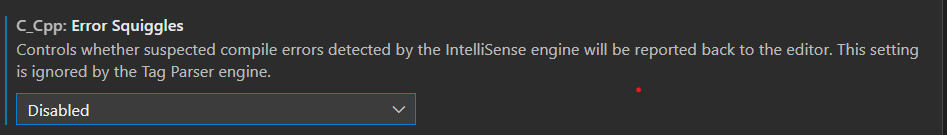

# 알고리즘 공부

-   [종만북](https://github.com/chisan01/TIL/tree/main/Algorithm/JongmanBook)
-   [ICPC 준비 - 2021 SW개발능력향상 프로그램](https://github.com/chisan01/TIL/tree/main/Algorithm/ICPC)
-   [BOJ](https://github.com/chisan01/TIL/tree/main/Algorithm/BOJ)
-   프로그래머스

### 알고리즘 공부 전략

* 예전에 C++로 한창 준비했었고, 한동안 java를 주로 사용하다가 요즘은 javascript를 공부 중이다.

  구체적인 문법들은 공식문서를 찾아보면서 하면 코딩하는데 문제가 있지는 않지만 확실히 문제푸는데 시간이 좀 오래 걸린다.

  알고리즘에 한해서는 언어를 하나 정해서 반복 숙달할 필요가 있을 듯.

https://plzrun.tistory.com/entry/%EC%95%8C%EA%B3%A0%EB%A6%AC%EC%A6%98-%EB%AC%B8%EC%A0%9C%ED%92%80%EC%9D%B4PS-%EC%8B%9C%EC%9E%91%ED%95%98%EA%B8%B0

1. 한 문제를 풀때 1~2시간이 넘어가면 다른 사람 코드를 참고해서 공부하기.
2. 문제를 풀더라도 다른 사람의 코드는 한번 읽어보고 참고하기.

### 입출력 최적화

```c++
  ios_base::sync_with_stdio(0);
  cin.tie(0);
```

> 알고리즘 문제를 풀 때는 싱글 쓰레드 환경을 사용하므로 위 코드로 동기화를 끊고 최적화해서 cin, cout을 쓰는게 시간적인 측면에서는 가장 좋을 것 같다. (동기화를 끊기 때문에 scanf, printf와 혼용하면 오답이 나올 수 있다.)  
> 참고: https://hegosumluxmundij.tistory.com/54

### 수행 시간 어림짐작하기

> 입력의 크기를 시간 복잡도에 대입했을때 그 값이 1억(10^8)을 넘어가면 시간 초과 가능성이 있다.

### 런타임 에러(bad_alloc)

> new 연산으로 메모리 할당이 실패하면 std::bad_alloc이라는 예외가 발생한다. 찾아보니 벡터를 너무 크게 선언해서 메모리 제한에 걸리면서 이러한 에러가 발생한 것 같다. (전역변수로 선언하면 할당되는 공간이 달라서 될때도 있다.)

### STL map에서 key 값으로 구조체 사용

> map에서 key 값으로 구조체를 사용하려면 < 연산자를 override 해줘야 한다.  
> 왜냐하면 map에서 기본적으로 key값을 기준으로 오름차순으로 정렬해서 저장하기 때문이다.

```c++
bool operator<(const 클래스명& 변수명) const
{
  //비교구문을 통해 true, false를 반환
}
```

> 2개의 값을 묶는 경우 구조체보다 pair를 사용하는것이 훨씬 편하다.
> 왜냐하면 pair 클래스의 경우 sort 알고리즘에 의해 정렬이 가능하기 때문에 그냥 사용할 수 있다.  
> (첫번째 인자 기준, 첫번째가 같으면 두번째 인자 기준으로 정렬한다.)

### 프로그램을 짜기전에 템플릿 미리 만들어두기.

> `#include`  
>  `using`  
>  `cin, cout 최적화`  
>  이러한 기초 환경을 템플릿처럼 만들어놓고 시작하면 시간도 줄이고 편리할 것 같다.

### vscode 괄호 자동 줄바꿈 설정

> https://velog.io/@esmin/VSCode-Visual-Studio-Code%EC%97%90%EC%84%9C-C%EC%BD%94%EB%94%A9-%EC%A4%91%EA%B4%84%ED%98%B8-%EC%9E%90%EB%8F%99-%EC%A4%84%EB%B0%94%EA%BF%88-%EC%84%A4%EC%A0%95

### vscode c++ 빨간줄 끄기



### STL sort 사용자정의 비교함수 사용

```c++
bool comp(int a, int b) {
  retrun a > b;
}

sort(v.begin(), v.end(), comp);
```

https://godog.tistory.com/entry/C-vector-%EC%98%A4%EB%A6%84%EC%B0%A8%EC%88%9C-%EB%82%B4%EB%A6%BC%EC%B0%A8%EC%88%9C-%EC%A0%95%EB%A0%AC

### C++에서의 struct

C++에서 struct는 class와 동작방식이 일치한다. 단, struct의 접근 지시자는 항상 public로 통일되어 있다는 차이점이 있다.

```c++
class DSU {
    vector<int> parent;
    vector<int> count;

   public:
    DSU(int n) : parent(n), count(n, 0) {
        for (int i = 0; i <= n; i++) {
            parent[i] = i;
        }
    }
```

이런 식으로 구조체와 클래스에서 생성자를 이용해 벡터의 값도 초기화 할 수도 있다.


