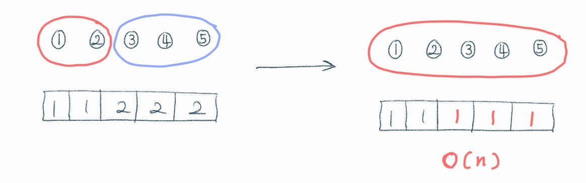
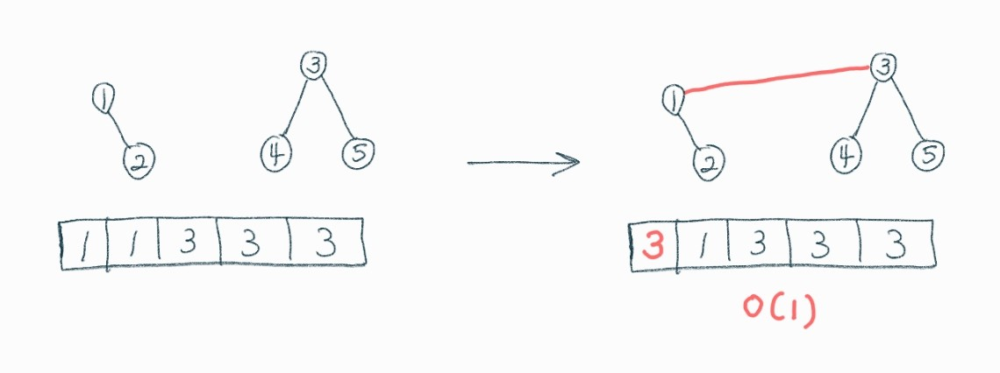
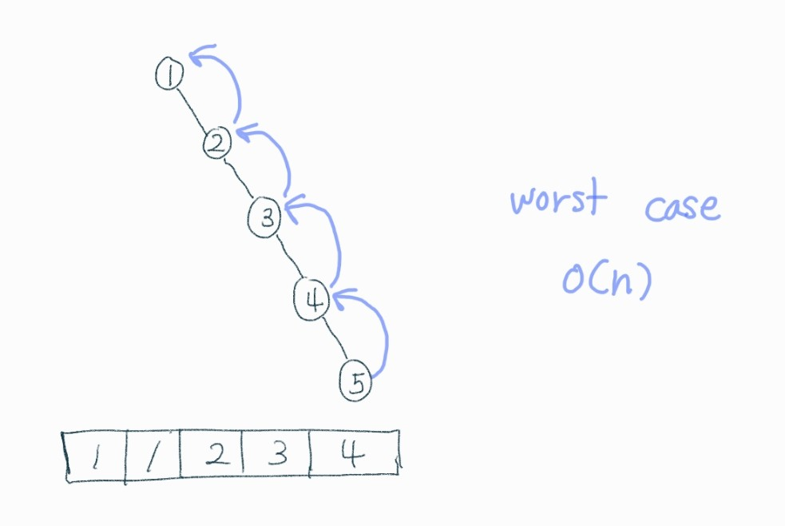
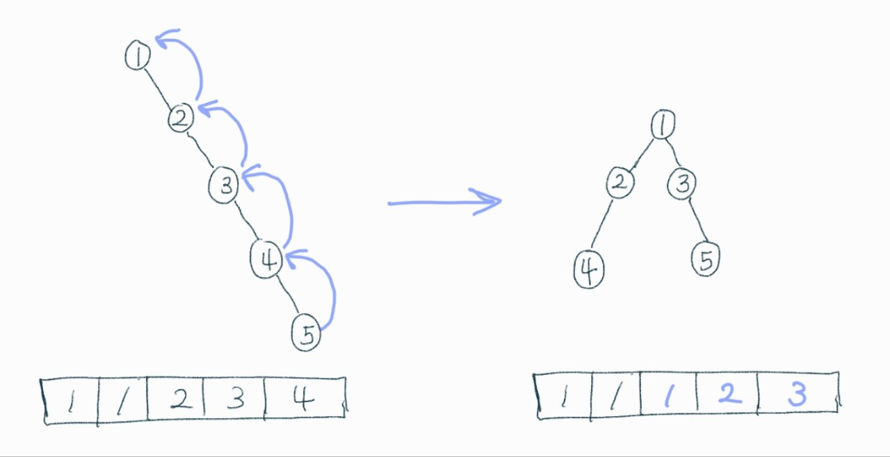

# UnionFind 자료구조

<br>

상호배타적 집합을 표현할때 유용하게 쓰이는 자료구조

> 상호배타적 집합 : 하나의 원소는 오직 하나의 집합에 포함된다.

<br>

### 상호배타적 집합에 필요한 연산

* **Find(A)** : 원소 A가 어떤 그룹에 속하는지 반환.
* **Union(A, B)** : 원소 A가 속한 그룹과 원소 B가 속한 그룹을 합침.

<br>

상호배타적 집합을 간단하게 구현한다면 각 원소의 집합을 표현하는 배열을 하나 선언해서 구현할 수 있을 것이다.



이 경우 Find 연산은 O(1) 시간이 걸리지만 Union연산은 그룹을 합칠때마다 하나의 그룹의 모든 배열 값을 업데이트 해줘야 해서 시간복잡도가 O(n)이다.

<br>

이때 트리를 사용해 상호 배타적 집합을 표현하면 이러한 연산들을 효과적으로 지원할 수 있다.



해당 원소의 루트 노드가 해당 원소의 그룹을 의미한다.

이 경우 Union 연산을 수행할때 한 그룹의 루트 노드를 다른 그룹의 루트 노드에 연결해주기만 하면 되기 때문에 Union 연산의 시간복잡도가 O(1)이 된다.



하지만 그림과 같이 트리가 생성될 경우 Find 연산의 시간복잡도가 O(n)이 될 수 있다.

이 때문에 트리의 높이를 줄이기 위해서 추가로 몇가지를 구현한다.

* **Union** : 트리의 높이가 낮은 그룹을 트리의 높이가 높은 그룹에 추가한다.

  > 그룹의 사이즈를 가지고도 비슷하게 구현할 수 있다.

* **Find** : find 연산을 수행하면서 부모 원소를 업데이트 함으로써 이후에 find 연산에 걸리는 시간을 최소화한다

  

<br>

### 대표적인 활용 사례

* 그래프의 연결성 확인하기
* 가장 큰 집합 추적하기

그리고 구현이 간단하고 동작 속도가 빨라서 다른 알고리즘의 일부로 사용되는 경우가 많다고 합니다.

<br>

### 문제 

* 유니온 파인드만 구현하면 풀 수 있는 문제 https://www.acmicpc.net/problem/1717
* https://www.acmicpc.net/problem/1976

<br>

### 구현 예시

<details><summary>UnionFind java</summary>


```java
class UnionFind {
    private final int[] parentOfNodes;
    private final int[] rank;

    public UnionFind(int numOfNode) {
        this.parentOfNodes = new int[numOfNode];
        this.rank = new int[numOfNode];

        for (int i = 0; i < parentOfNodes.length; i++) {
            parentOfNodes[i] = i;
            rank[i] = 0;
        }
    }

    public int find(int node) {
        if (node == parentOfNodes[node]) return node;
        else return parentOfNodes[node] = find(parentOfNodes[node]);
    }

    public boolean areSameGroup(int node1, int node2) {
        int group1RootNode = find(node1);
        int group2RootNode = find(node2);

        return group1RootNode == group2RootNode;
    }

    public void union(int node1, int node2) {
        int group1RootNode = find(node1);
        int group2RootNode = find(node2);

        if (areSameGroup(group1RootNode, group2RootNode)) return;

        if (rank[group1RootNode] < rank[group2RootNode]) {
            parentOfNodes[group1RootNode] = group2RootNode;
            rank[group2RootNode]++;
        } else {
            if (rank[group1RootNode] == rank[group2RootNode]) {
                rank[group1RootNode]++;
            }
            parentOfNodes[group2RootNode] = group1RootNode;
        }
    }
}
```

</details>