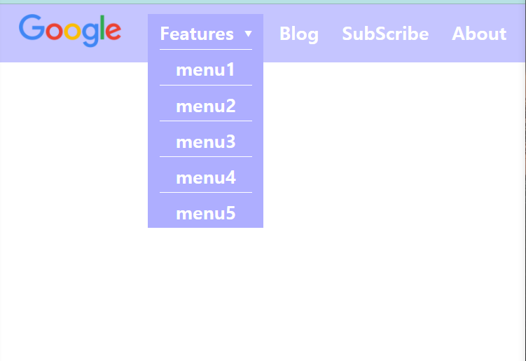

# 프로그래머스

## Lv.2 [짝지어 제거하기](https://programmers.co.kr/learn/courses/30/lessons/12973)

단순하게 구현했더니 효율성테스트에서 실패했다.

생각해보니 수행여부만 확인하면 되서 실제로 문자열을 자르고 붙일 필요가 없다.

실패. `질문하기`를 참고해서 스택을 사용해서 풀면 되겠다는 힌트를 얻었다.

> Stack을 사용하는 문제인걸 알고 푸는거랑 모르고 푸는거랑 느낌이 많이 다르다.<br/>모르고 푸는 연습을 많이 하자. 프로그래머스 이외에도 solved.ac CLASS 문제로 연습할 수 있을듯

<details><summary>소스코드</summary>

```java
import java.util.*;

class Solution
{
    public int solution(String s)
    {
        if(s.length()%2 != 0) return 0; // 길이가 홀수인경우 불가능
        
        Stack<Character> S = new Stack<>();
        for(int i=0; i<s.length(); i++) {
            if(!S.empty() && S.peek() == s.charAt(i)) S.pop();
            else S.push(s.charAt(i));
        }
        if(S.empty()) return 1;
        else return 0;
    }
}
```

</details><br/><br/>

# JavaScript 공부

> [React 공식문서](https://reactjs.org/docs/getting-started.html#react-for-beginners)에서 추천해 준 [튜토리얼](https://www.taniarascia.com/getting-started-with-react/)에서 추천하는 [사이트](https://www.digitalocean.com/community/tutorial_series/how-to-code-in-javascript)를 참고해서 공부했다.

## 개발자도구

### 콘솔창

브라우저에서 콘솔창 여는 단축키 : `Ctrl+Shift+J`

### Network 탭 활용

* debug request issues
* optimize page load performace

<br/>

## how to incorporate JavaScript into web files

### 1. HTML Inline

`<script>` 태그를 사용해 `<header>`나 `<body>` 안에 넣는다.

> 두 군데에 다 넣었더니 `<header>`에 있는 script만 실행이 되고 `<body>`에 있는 script는 실행이 되지 않아서 둘 중 한 곳만 넣어야 되나 했는데 알고보니 이름이 동일한 변수를 사용하면서 오류가 나서 그랬다.

### 2. Seperate File

`<script>` 태그의 `src` attribute로 js파일을 지정해서 사용한다.

### script 동작 구조

* **head에 위치했을 경우**

  1. HTML parsing
  2. script를 만나면 다운받고 실행시킨다.
  3. HTML parsing

* **body 끝에 사용**

  1. HTML parsing
  2. script 다운 및 실행

* **head에 위치했을 경우 + async**

  1. HTML parsing
  2. script를 만나면 비동기적으로 다운 받는다 + HTML parsing
  3. script의 다운이 완료되면 HTML parsing을 멈추고 실행시킨다.

* **head에 위치했을 경우 + defer**

  1. HTML parsing
  2. script를 만나면 비동기적으로 다운 받는다 + HTML parsing
  3. HTML parsing이 완료되면 다운받은 script들을 차례대로 실행시킨다.

  > 주의 : inline script에선 defer를 사용해도 아무 효과가 없다.

<br/>

## 입출력 메소드 in browser

### 출력

* alert()
* console.log()

### 입력

* prompt()

<br/>

> **참고자료**
>
> 1. Tagliaferri L. How To Use the JavaScript Developer Console. DigitalOcean. Published June 29, 2017. Accessed January 11, 2022. https://www.digitalocean.com/community/tutorials/how-to-use-the-javascript-developer-console
> 2. Tagliaferri L. How To Add JavaScript to HTML. DigitalOcean. Published June 30, 2017. Accessed January 11, 2022. https://www.digitalocean.com/community/tutorials/how-to-add-javascript-to-html
> 3. 드림코딩 by 엘리. 자바스크립트 2. 콘솔에 출력, script async 와 defer의 차이점 및 앞으로 자바스크립트 공부 방향 | 프론트엔드 개발자 입문편 (JavaScript ES5+). *YouTube*. Published online April 7, 2020. Accessed January 11, 2022. https://www.youtube.com/watch?v=tJieVCgGzhs
> 4. : The Script element - HTML: HyperText Markup Language | MDN. Mozilla.org. Published December 27, 2021. Accessed January 11, 2022. https://developer.mozilla.org/en-US/docs/Web/HTML/Element/script
> 5. Tagliaferri L. How To Write Your First JavaScript Program. DigitalOcean. Published August 2, 2017. Accessed January 11, 2022. https://www.digitalocean.com/community/tutorials/how-to-write-your-first-javascript-program

<br/>

<br/>

# HTML&CSS

## dropdown menu

### z-index

요소들이 몇번째 순서로 표시될지 지정할 수 있다.

### display: none

특정 조건에만 해당 element가 표시되도록 만들 수 있다.



`display: none`이랑 `z-index`를 참고하긴했지만 코드는 거의 안 보고 만들었고 결과물도 나름 깔끔하게 만들어진 것 같아서 만족한다.

<br/>

> **참고자료**
>
> 1. Advanced Positioning Tutorial | HTML & CSS Is Hard. Internetingishard.com. Published 2017. Accessed January 11, 2022. https://www.internetingishard.com/html-and-css/advanced-positioning/

<br/><br/>

# 스프링부트

김영한님 인프런 강의 (스프링입문) 들으면서 공부한 내용 정리

## 스프링 컨테이너

스프링에서 객체들을 생성 및 관리하기 위해 **스프링 컨테이너**에 **스프링 빈**을 등록해서 사용한다.

> 이렇게 함으로써 얻는 이점들이 많기 때문에 스프링을 쓸 때 스프링 빈을 적극 활용해야 한다.

그리고 스프링 빈을 등록할때 기본적으로 하나의 객체만을 생성하는데 이를 **싱글톤**이라고 한다.

> 특수한 경우 싱글톤이 아니게 설정할 수 있긴 하다.

### 스프링 빈 등록

#### 컴포넌트 스캔

클래스에 **`@Component`** 어노테이션을 붙이면 스프링빈으로 자동 등록된다.

그리고 `@Controller`, `@Service`, `@Repository`는 `@Component` 어노테이션을 포함하고 있다.

`@SpringBootApplication` 어노테이션이 사용된 클래스의 패키지를 기준으로 해당 패키지와 하위 패키지에 대해서만 **컴포넌트 스캔**이 이루어진다.

> `@SpringBootApplication`을 보면 `@ComponentScan` 어노테이션이 포함되어 있는 것을 확인할 수 있다.

따라서 이외의 경우 직접 자바 코드를 이용해서 스프링 빈으로 등록해줘야 한다.

#### 자동 의존관계 설정 (DI)

스프링 빈에 한해서 `@Autowird`를 붙이면 해당 객체가 생성될때 스프링이 연관된 객체를 스프링 컨테이너에서 찾아서 넣어준다.

#### DI 방법

* **필드 주입** : 의존관계를 따로 지정해줄 수 없다.<br/>간단해서 테스트할때는 종종 사용한다.
* **setter 주입** : 안정성이 좀 떨어진다.<br/>실행 중에 의존관계가 변하는 경우가 거의 없기 때문에 거의 사용하지 않는다.
* **생성자 주입** : 가장 많이 사용하는 방식

#### 자바 코드로 직접 등록하는 방법

1. `@Configuration`을 사용해서 설정 클래스를 만들어준다.
2. `@Bean` 어노테이션을 사용해서 객체를 생성하는 함수를 만들어준다. (DI도 설정해준다.)

컴포넌트 스캔이 이루어지지 않는 경우, 정형화 되지 않은 경우, 그리고 구현 클래스를 변경해야 하는 경우 설정을 통해 스프링 빈으로 등록하는 것이 좋다.

> 구현 클래스를 변경할때 설정 파일만 수정해주면 되서 더 간편하다.

<br/>

## Intellij 꿀팁

### 단축키

**Go to Class** : `Ctrl+N`

`Ctrl+X` : 기본적으로 잘라내기 기능이지만 한 줄 전체를 잘라내기 때문에 삭제할때도 유용하게 사용할 수 있다.

**Go To -> Implementation** : `Ctrl+Alt+B`<br/>`Ctrl+B` 는 Declaration이랑 usages

### 탭 개수 제한

Editor Tabs -> Closing Policy에서 Tab limit을 1로 설정.

탭 관련된 여러 단축키를 알고나니 더 이상 탭을 여러 개 열어둘 필요도 없고 탭이 많으니깐 오히려 정신없어서 하나만 보이도록 설정을 바꿨다.

<br/>

> **참고자료**
>
> 1. Is there a way to have “Navigate to Declaration” open a new tab instead of changing existing tab’s content?. IDEs Support (IntelliJ Platform) | JetBrains. Published March 22, 2016. Accessed January 11, 2022. https://intellij-support.jetbrains.com/hc/en-us/community/posts/206569349-Is-there-a-way-to-have-Navigate-to-Declaration-open-a-new-tab-instead-of-changing-existing-tab-s-content-