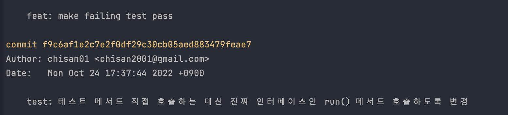

## TDD를 할 때 의미있는 커밋 단위는 어느정도일까?

책 TDD의 예제를 따라서 실습해보던 중 문득 이런 생각이 들었다.

TDD의 단계가 다음과 같은데 단계별로 커밋을 생성하는게 좋을까?

> 그리고 단계별로 커밋을 생성한다면 어떤 식으로 생성하는게 좋을까
>
> 지금은 1번 단계에서 제목을 자세하게 적고, 2번 단계에서는 1번 단계를 보고 작업 내용을 유추할 수 있기 때문에 `make it pass` 정도로 간단하게 적는 방식을 사용중인데 괜찮은 방법일까?

1. make failing test
2. make it pass
3. refactoring



아니면 예를 들어 위의 예제의 경우

```
feat: 테스트 메서드 직접 ~
```

이렇게 `구현`을 키워드로 하나로 묶는게 더 좋을까?

<br>

조금 생각해보고 나니깐 우선 최대한 자잘하게 나눠서 작성해야 추후에 코드 리뷰를 받을 때 리뷰어의 입장에서 이 사람이 어떤 의도를 가지고 해당 코드를 작성했는지 생각의 흐름을 파악하기가 더 쉬워져서 좋을 것 같았고,

> 코드 리뷰가 원활하게 이루어지기 위해선 작성자가 고생해서 리뷰어의 시간을 아껴줘야 한다!
>
> https://youtu.be/ssDMIcPBqUE?t=3311

만약 커밋이 너무 많아진 경우에는 추후에 rebase를 통해 커밋을 묶는 식으로 하는 것이 좋을 것 같다.