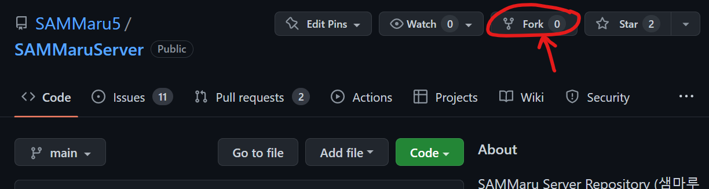
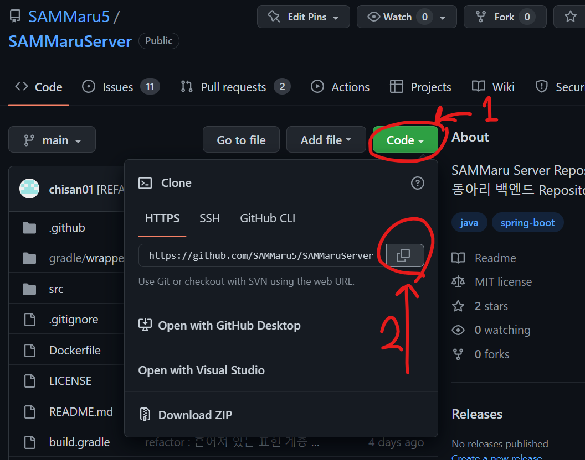

## 협업을 진행하기 위한 초기 설정

<br>

1. 협업을 진행할 Repository를 fork 해온다.

    fork 할 repository에서 fork 버튼을 클릭하면 된다.

    

<br>

2. fork 해온 repository를 컴퓨터에 clone 받는다. 

    프로젝트 폴더를 다운받을 위치에서 Terminal을 실행한 뒤 다음 명령어를 입력합니다.

    ```bash
    git clone <repository 주소>
    ```
    > ex) `git clone https://github.com/chisan01/git_github_practice.git`

    repository의 주소는 github에서 다음과 같이 복사해 올 수 있다.

    

<br>

3. upstream을 설정해준다.

    > `origin` : 자신의 repository
    >
    > `upstream` : fork 해 온 repository

    ```bash
    git remote add upstream <fork 해온 repository 주소>
    ```

    다음 명령어로 origin과 upstream으로 설정된 주소를 확인할 수 있다.

    ```bash
    git remote -v
    ```