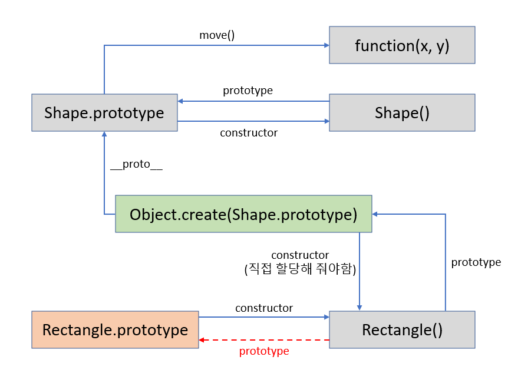

# Prototype and Inheritance

JavaScript는 **prototype** 기반 언어이다. 따라서 java 등의 class 기반 언어와는 좀 다르다.

클래스 간의 상속관계가 형성되고, 해당 클래스로부터 객체를 생성해서 사용하는 것이 아닌, **prototype**이라는 개념을 통해 객체와 객체 간의 직접적인 상속 관계가 형성된다.

> ES6부터 `class`가 추가되었지만 이는 단순히 prototype을 class처럼 사용할 수 있게 해주는 syntactical sugar에 불과하다.

<br>

## Prototype

### prototype chain

객체의 property(메소드 포함)를 접근할때 객체 -> 객체의 prototype -> 연결된 객체의 prototype -> ... 순으로 접근한다.

우리가 기본적으로 제공되는 `Array` 객체에서 `sort()` 등 다양한 메소드를 활용할 수 있는 이유도 `Array.prototype`에 이러한 메소드들이 정의되어 있기 때문이다.

```js
Object.getPrototypeOf(arr) === Array.prototype; // true
```

모든 prototype chain의 끝은 `Object.prototype`이고, 여기서도 해당 property를 찾지 못하면 `null`이 반환된다.

> property와 prototype을 헷갈리지 않도록 주의하자.
>
> 예를 들어 constructor function의 prototype은 `Function.prototype`이다.
>
> ```js
> Object.getPrototypeOf(Array) === Function.prototype; // true
> Array instanceof Function; // true
> ```

<br>

### `prototype` vs `__proto__`

처음 공부한다면 헷갈리기 쉬운 개념

* **`Object.prototype`**

  해당 함수로부터 생성된 객체의 prototype을 가리키는 property

  ```js
  console.log(Array.prototype.constructor === Array); // true
  ```

* **`Object.__proto__`**

  객체의 prototype을 저장하는 내부 property

  ```js
  let arr = [];
  console.log(arr.__proto__ === Array.prototype); // true
  ```

  그리고 `__proto__`는 예전에 웹브라우저와의 호환성을 위해 이용되던 것으로 현재는 사용이 권장되지 않는다. `Object.getPrototypeOf()`을 사용하자.

```js
console.log(Array.prototype.__proto__ === Object.prototype); // true
```

<br>

### 관련 메소드

* **`prototype.isPrototypeOf()`**

  객체의 prototype chain에 해당 prototype이 존재하는지 반환

  (즉, 객체가 해당 prototype을 상속받았는지 여부를 반환해준다)

  ```js
  let arr = [];
  Array.prototype.isPrototypeOf(arr); // true
  ```

* **`instanceof`**

  object의 prototype chain에 해당 constructor가 존재하는지 여부를 반환

  ```js
  let arr = [];
  console.log(arr instanceof Array); // true
  ```

* **`Object.getPrototypeOf()`**

  객체의 prototype을 반환해준다.

  ```js
  let arr = [];
  console.log(Object.getPrototypeOf(arr) === Array.prototype); // true
  ```

* **`Object.setPrototypeOf()`**

  `obj`의 prototype을 `prototype`으로 설정한다.

  ```js
  Object.setPrototypeOf(obj, prototype)
  ```

  객체의 prototype을 동적으로 수정할 수 있다. 하지만 JavaScript engine이 property 접근을 최적화하는 방식의 특성상 prototype을 동적으로 수정하는 작업이 굉장히 느리기 때문에 성능을 위해서는 `Object.create()`를 사용해야 한다.

  > 처음에 잘못 이해했었는데 `Object.create()`는 해당 객체를 prototype으로 갖는 **새로운** 객체를 생성하는 것이기 때문에 기존에 존재하는 객체의 prototype을 수정해야만 하는 경우에는 `Object.setPrototypeOf()`를 사용해야 한다.

* **`Object.create()`**

  지정된 객체를 prototype을 갖는 새 객체를 만든다.

  ```js
  const obj = {};
  const obj2 = Object.create(obj);
  Object.getPrototypeOf(obj2) === obj; // true
  ```

  primitive wraper objects는 prototype으로 지정할 수 없다.

  또한 prototype으로 null을 지정할 수 있지만 `Object.prototype`의 함수들을 이용할 수 없기 때문에 이용에 주의해야 한다.

  ```js
  const obj = {};
  console.log("obj is: " + obj); // obj is: [object Object]
  
  const obj2 = Object.create(null);
  console.log("obj2 is: " + obj2); // Error
  ```

  * ##### Object.create()를 이용한  classical inheritance

    MDN 공식문서에 나와있는 예제

    ```js
    // Shape - superclass
    function Shape() {
      this.x = 0;
      this.y = 0;
    }
    
    // superclass method
    Shape.prototype.move = function(x, y) {
      this.x += x;
      this.y += y;
      console.info('Shape moved.');
    };
    
    // Rectangle - subclass
    function Rectangle() {
      Shape.call(this); // call super constructor.
    }
    
    // subclass extends superclass
    Rectangle.prototype = Object.create(Shape.prototype);
    
    //If you don't set Rectangle.prototype.constructor to Rectangle,
    //it will take the prototype.constructor of Shape (parent).
    //To avoid that, we set the prototype.constructor to Rectangle (child).
    Rectangle.prototype.constructor = Rectangle;
    
    var rect = new Rectangle();
    
    console.log('Is rect an instance of Rectangle?', rect instanceof Rectangle); // true
    console.log('Is rect an instance of Shape?', rect instanceof Shape); // true
    rect.move(1, 1); // Outputs, 'Shape moved.'
    ```

    위 예제에서의 prototype 연결 관계

    

<br>

## Constructor functions

새로운 객체를 설계할때 사용되는 함수. 이름의 첫글자를 대문자로 사용하는것이 일반적이다.

instance 옆에서 `new` 연산자와 함께 사용된다. 이때 `new` 연산자는 constructor 함수에 기반하여 새로운 instance를 만들어준다.

```js
function Person(name, age) {
    this.name = name;
    this.age = age;
}

let joshua = new Person('Joshua', 23);
```

### `this` keyword

constructor 함수 안에서 `this`는 새롭게 생성되는 instance를 가리킨다.

### Chain Constructor

`call()`을 활용해서 Constructor를 복사할 수 있다.

이때, `call()`을 사용하더라도 prototype이 연결되지는 않는다는 점에 주의하자.

```js
function Worker (name, age, job) {
    Person.call(this, name, age);

    this.job = job;
}
```

<br>

## Method

효율성 증가와 코드 가독성을 위해 method는 construction에 포함하지 않고 이후에 따로 prototype에 추가하는 것이 일반적이다.

prototype에 추가하고 나면 해당 prototype을 상속한 instance들은 모두 해당 method를 사용할 수 있다.

```js
Person.prototype.introduce = function {
    return `Hi my name is ${this.name}!`;
}

joshua.introduce(); // Hi my name is Joshua!
```

**이때 method를 arrow function으로 만들어서는 안된다는 것에 주의하자.**<br>arrow function의 특성상 `this`가 해당 객체가 아닌 전역 객체를 가리키게 된다.

<br>

## Class

ES6부터 추가된 개념. prototype inheritance에 대한 **syntactical sugar**

Java 등의 클래스 기반 언어에 익숙하다면 `class`를 이용해 기존의 prototype inheritance를 보다 직관적인 문법으로 사용할 수 있다.


<br>

## `classical inheritance`와 `prototypal inheritance` 차이점

* https://stackoverflow.com/questions/19633762/classical-inheritance-vs-prototypal-inheritance-in-javascript/19640910#:~:text=Classical%20inheritance%20is%20limited%20to,also%20objects%20inheriting%20from%20prototypes.
* https://developer.mozilla.org/en-US/docs/Web/JavaScript/Inheritance_and_the_prototype_chain
* https://www.geeksforgeeks.org/explain-prototype-inheritance-in-javascript/

<br><br>

> **참고자료**
>
> 1. Rascia T. Understanding Prototypes and Inheritance in JavaScript. DigitalOcean. Published January 12, 2018. Accessed January 27, 2022. https://www.digitalocean.com/community/tutorials/understanding-prototypes-and-inheritance-in-javascript
> 2. Inheritance and the prototype chain - JavaScript | MDN. Mozilla.org. Published January 17, 2022. Accessed February 1, 2022. https://developer.mozilla.org/en-US/docs/Web/JavaScript/Inheritance_and_the_prototype_chain
> 3. lukeaus. Object.getPrototypeOf() vs .prototype. Stack Overflow. Published August 3, 2016. Accessed February 1, 2022. https://stackoverflow.com/questions/38740610/object-getprototypeof-vs-prototype
> 4. Object.prototype.__proto__ - JavaScript | MDN. Mozilla.org. Published January 30, 2022. Accessed February 1, 2022. https://developer.mozilla.org/ko/docs/Web/JavaScript/Reference/Global_Objects/Object/proto
> 5. Object.getPrototypeOf() - JavaScript | MDN. Mozilla.org. Published July 20, 2021. Accessed February 1, 2022. https://developer.mozilla.org/en-US/docs/Web/JavaScript/Reference/Global_Objects/Object/getPrototypeOf
> 6. Object.setPrototypeOf() - JavaScript | MDN. Mozilla.org. Published February 2022. Accessed February 1, 2022. https://developer.mozilla.org/ko/docs/Web/JavaScript/Reference/Global_Objects/Object/setPrototypeOf
> 7. Object.create() - JavaScript | MDN. Mozilla.org. Published February 2022. Accessed February 1, 2022. https://developer.mozilla.org/ko/docs/Web/JavaScript/Reference/Global_Objects/Object/create
> 8. Jesus. Extends Object.setPrototypeOf() vs Object.create. Stack Overflow. Published October 14, 2019. Accessed February 1, 2022. https://stackoverflow.com/questions/58377377/extends-object-setprototypeof-vs-object-create
> 9. Matt. Understanding the difference between Object.create() and new SomeFunction(). Stack Overflow. Published November 12, 2010. Accessed February 1, 2022. https://stackoverflow.com/questions/4166616/understanding-the-difference-between-object-create-and-new-somefunction
> 10. 
